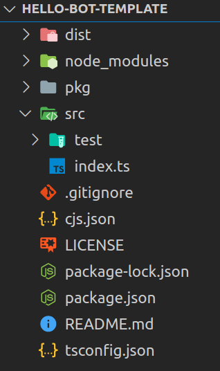

# Directory Structure

You can use CJS using Typescript or Javascript and `npm` package manager. When you setup a project using `cjs new` command, you will see the following project structure:



In the `index.ts` file, we define our entire application, which is then used by Chitchat as a hook to generate all the artifacts, dialog engine and wire all the blocks and their implementation together automatically.

You will see a `cjs.json` in the root of the project. This configures the build process behavior.

## Building a package

When you use `cjs build` to build your project, it creates a `/pkg` directory in your skill project. This directory will contain all the generated artifacts, your skill code etc. When you deploy using `cjs deploy`, it deploys the content of the `/pkg` directory.

::: tip
You must commit this directory, because removing this directory will cause cjs to generate a new skill id. There are ways to update the skill id in the generate `/pkg`. But keeping `/pkg` in a git repo is much easier!
:::

## Build Configurations

Build configurations are defined in the `cjs.json` in your project root.

```json
{
  "outDir": "./pkg",
  "target": "Alexa"
}
```

| Config   | Description                                     | Required |
| -------- | ----------------------------------------------- | -------- |
| `outDir` | Location of the output directory.               | Yes      |
| `target` | Platform you want to deploy to. Can be `Alexa`. | Yes      |

## Deploy

Deploys the project to the target platform.

```
$ cjs deploy
```

::: warning
Make sure you have [ASK CLI installed and configured](https://www.npmjs.com/package/ask-cli). Without that `cjs deploy` will not work as it uses ASK CLI under the hood.
:::
