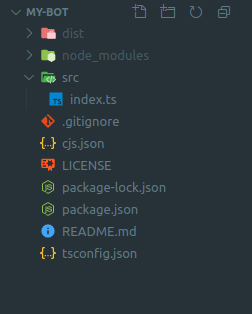

# Getting Started


## Prerequisites

Chitchat requires the following dependencies:

-   Node.js
-   [ASK CLI (configured)](https://www.npmjs.com/package/ask-cli)

## Quick Start


1. Install CLI

```sh
npm install -g @chitchat/cli
```

2.  Create a new project

```sh
cjs new
```

3. Build the project

```sh
cjs build
```

4. Deploy

```sh
cjs deploy
```

## Directory Structure

A Chitchat project will look something like this. It may be a Typescript or Javascript package using `npm` package manager.



In the `index.ts` file, we define our entire application, which is then used by Chitchat as a hook to generate all the artifacts, dialog engine and wire all the blocks and their implementation together automatically.

Package comes with couple of Chitchat dependencies - `@chitchatjs/core` - a core primitive library and `@chitchatjs/alexa` - an Alexa oriented building block library. We will use components from these libraries to manufacture our voice interfaces.

Let's take a look how a simple dialog might look like in CJS.

## First Dialog

Let's take a simple example, where we want to listen to an event where user says `"hello agent"` to our application and application says `"hello world"` back. To do this, we need to build a Block.

```ts
import { blocks } from "@chitchatjs/core";

let greetingBlock = blocks
    .when()
    .userSays(["hello agent"])
    .then(blocks.says("hello world!").build())
    .build();
```

Output:

```
User: hello agent
Agent: hello world!
```

Now, we can make it better by adding dynamic data into it:

```ts
blocks
    .compound()
    // A block to set the user name in the state
    .add(
        blocks
            .setStateVar()
            .set((ctx: Context, event: Event) => {
                return { name: myDB.getUserName() };
            })
            .build()
    )
    // A block to render speech
    .add(
        blocks
            .when()
            .userSays(["hello agent"])
            .then(blocks.say("hello world, {name}!").build())
    )
    .build();
```

Output:

```
User: hello agent
Agent: hello world, Kevindra!
```

As you can see, `{name}` will carry the state from the previous block automatically.
